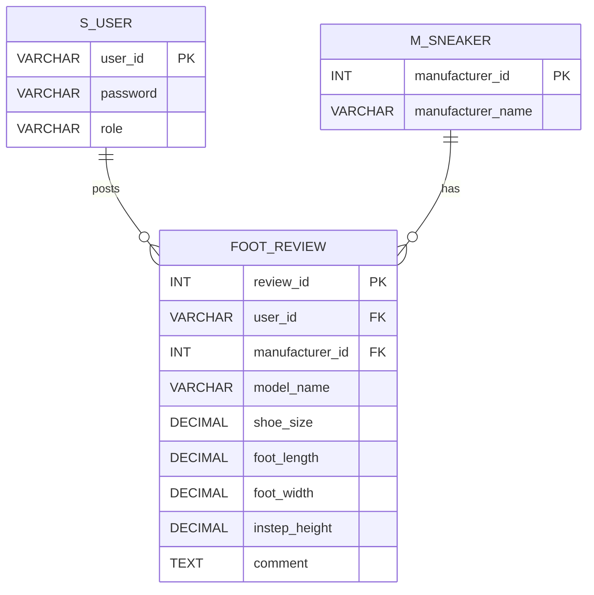

# Spring BootとSpring Securityを用いて開発したスニーカーレビューサイトです。

## 目的

学習した技術を活かし、基本的な機能を実装したWEBアプリケーションを作成することを目的として制作しました。

## 開発環境

### バックエンド

* Java 21
* Spring Boot 4.0.2
* Spring Security
* Maven 3.9.11

### フロントエンド

* HTML / CSS
* Bootstrap 5.3.2

### データベース

* MySQL 8.0.44
* DBeaver

### 開発ツール

* Eclipse IDE for Java Developers 2025-09 (4.37.0)

## 制作背景

一般的なスニーカーのレビューでは、

* 「このスニーカーは幅が狭いので0.5cm大きめがおすすめ」
* 「デザインが良い」
* 「サイズ感は普段通り」

といった主観的な評価が多く見受けられます。

しかし実際には、

* 足の長さ
* 足幅
* 甲の高さ

などの具体的な数値情報が不足しており、購入前に適切なサイズ感を判断することが難しいと感じました。

そこで、足のサイズ・足幅・甲の高さといった具体的な数値情報を投稿できるレビューサイトを作成しました。
利用者が自身の足の特徴と照らし合わせながら商品を選択できる環境を目指しています。

---

## アプリ概要

Spring Bootの三層アーキテクチャとSpring Securityを使用して開発したスニーカーのレビューサイトです。

ユーザーがスニーカーのレビューを投稿し、他のユーザーがレビューを参考に商品を選択できるWEBアプリケーションです。

---

## 使用技術

* Java
* Spring Boot
* Spring Security
* Maven
* HTML / CSS
* MySQL

---

## データベース設計

## 実装機能

### ユーザー機能

* ユーザー登録
* ログイン機能

### レビュー機能

* レビュー投稿
* レビュー編集
* レビュー削除
* レビュー一覧表示

---

## 今後の改善点
* レビューする側へのメリットの追加（いいね機能やログインしているユーザーはコメントが書けるなど）
* スニーカーのモデル名による部分一致検索機能の追加
* ユーザーアカウント管理機能の改善

ログイン機能を実装する中で、ユーザー削除とレビューの扱いについて設計上の課題を感じました。
当初はユーザー削除と同時にレビューも削除する仕様を検討しましたが、レビューが消えることでサービスの価値が下がる可能性を感じたため、ユーザー削除機能は実装していません。

---

## 学んだこと

Spring Securityには、アカウントの有効期限などを制御できるメソッドがあり、認証・認可の仕組みの奥深さを実感しました。

また、機能追加の過程で、ファイル名やクラス名などの命名を初期段階で慎重に設計する重要性を学びました。
途中で名称変更が必要になり、関連ファイルの修正に多くの時間を要しました。

実際に手を動かして開発することで、エラーに直面しながら、試行錯誤を繰り返す経験が理解を深めることにつながりました。

---

